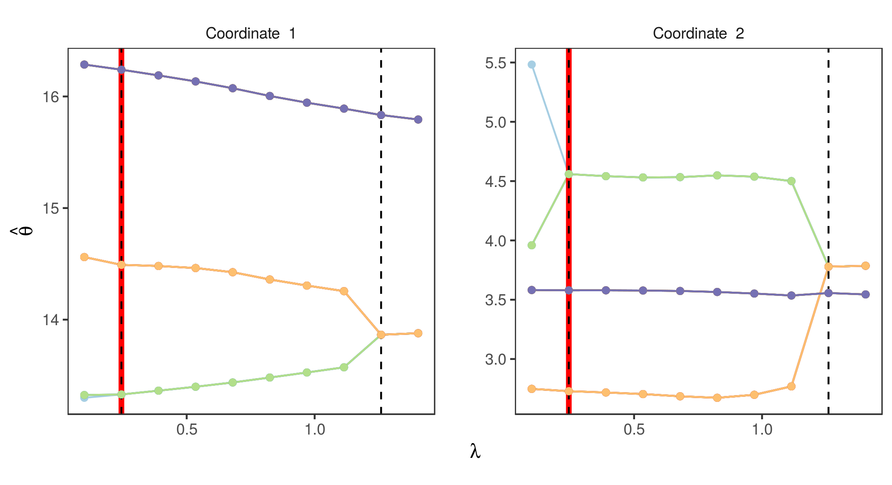
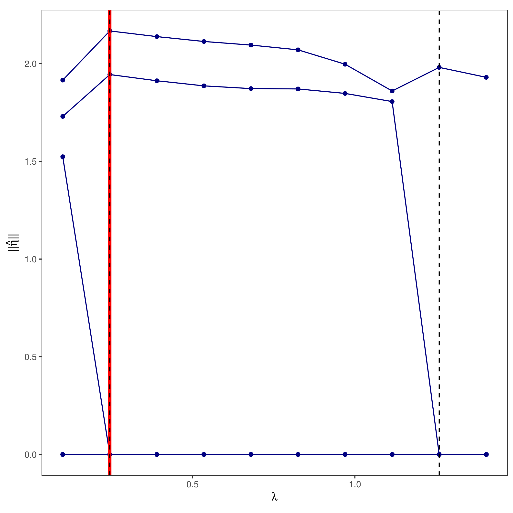
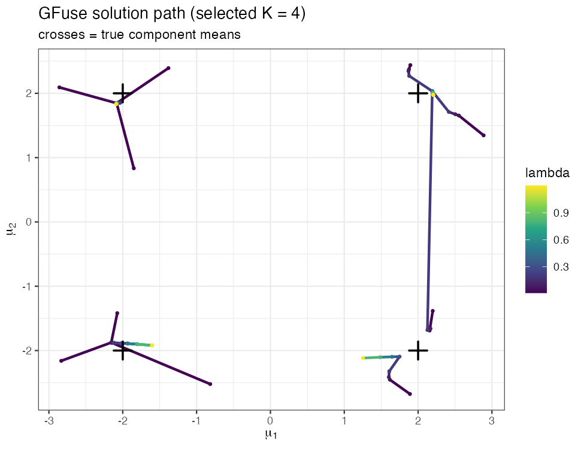

# GFuse: Graph-Guided Regularization for Finite Mixture Models

**GFuse** estimates the number of components (the *order*) of a finite mixture
model and — just as importantly — turns the fitted model into an **interpretable
graph and solution path** for *diagnosing the latent structure of heterogeneous
data*.

The idea: start from an over-specified mixture (more components than needed) and
regularize it along a **graph defined on the component atoms**. As the penalty
strength `λ` increases, redundant components are pulled together and merge. The
resulting **solution path** is the diagnostic output — the *order in which
components merge* reveals a hierarchy of similarity among the underlying
subpopulations, information that a single integer from AIC/BIC cannot provide.

GFuse generalizes the Group-Sort-Fuse (GSF) procedure of Manole & Khalili (2021)
by allowing flexible, geometry-adaptive graph constructions:

| Graph (`graphtype`) | Description |
|---|---|
| `"MNN"` | Mutual *m*-nearest-neighbour graph (set neighbourhood size with `m`); the **adaptive *m*-NN** chooses `m` by BIC and is the recommended default |
| `"MST"` | Minimum spanning tree of the atoms |
| `"GSF"` | Group-Sort-Fuse sorted chain (the original procedure) |

Supported mixture families:

| Function | Family |
|---|---|
| `normalLocOrder` | Multivariate Gaussian location mixtures (common, possibly unknown covariance) |
| `tLocOrder` | Multivariate Student-*t* location mixtures (robust to heavy tails / outliers) |
| `multinomialOrder` | Multinomial mixtures |
| `poissonOrder` | Poisson mixtures |
| `exponentialOrder` | Exponential mixtures |

## Installation

```r
# install.packages("devtools")
devtools::install_github("ptang268/GFuse")
```
The package compiles C++ (via Rcpp/RcppEigen), so a working compiler toolchain is
required.

## Quick start

```r
library(GFuse)

## A bundled dataset: 2 geometric measurements on 210 seeds of 3 varieties
y <- seeds[, c(2, 6)]
n <- nrow(y)

## Fit the graph-guided estimator along a path of tuning parameters lambda,
## starting from an over-specified K = 12 components, 2-NN graph, SCAD penalty
lambdas <- seq(0.1, n^(-0.25) * log(n), length.out = 10)
out  <- normalLocOrder(y, m = 2, K = 12, lambdas = lambdas,
                       graphtype = "MNN", arbSigma = TRUE, penalty = "SCAD")

## Select an order by the modified BIC
tune <- bicTuning(y, out)
tune$result$order    # selected number of components
tune$result$lambda   # corresponding tuning parameter
```

## The solution path as a diagnostic tool

The fitted object stores the atom estimates at every `λ`, so the whole
regularization path can be visualized. The built-in plot method shows the
**coefficient paths** (each component parameter vs. `λ`); the dashed vertical line
marks the BIC-selected `λ`:

```r
plot(out, gg = TRUE, eta = FALSE, vlines = TRUE, opt = tune$result$lambda)
```


A complementary one-dimensional view plots the norms of the sorted atom
differences, making the merges explicit:

```r
plot(out, gg = TRUE, eta = TRUE, vlines = TRUE, opt = tune$result$lambda)
```


### Reproducing the parameter-space solution path

For low-dimensional problems it is often most informative to trace each atom's
trajectory directly in parameter space, coloured by `λ` (the style used in the
accompanying paper). The fitted object makes this a few lines:

```r
library(GFuse); library(ggplot2)
set.seed(1)

## simulate a 4-component 2-D Gaussian mixture (square configuration)
mu <- cbind(c(-2,-2), c(-2,2), c(2,-2), c(2,2))
n  <- 400; z <- sample(4, n, replace = TRUE)
y  <- t(vapply(seq_len(n), function(i) mu[, z[i]] + rnorm(2), numeric(2)))

## regularization path with the 2-NN graph, starting from K = 10
lambdas <- c(0.01, 0.05, 0.1, 0.2, 0.3, 0.5, 0.8, 1.2)
out  <- normalLocOrder(y, m = 2, K = 10, lambdas = lambdas,
                       graphtype = "MNN", penalty = "SCAD")
tune <- bicTuning(y, out)

## collect each atom's (mu1, mu2) position at every lambda
path <- do.call(rbind, lapply(seq_along(out), function(i) {
  M <- out[[i]]$mu
  data.frame(lambda = out[[i]]$lambda, atom = seq_len(ncol(M)),
             mu1 = M[1, ], mu2 = M[2, ])
}))

ggplot(path, aes(mu1, mu2, group = atom, colour = lambda)) +
  geom_path(linewidth = 1) + geom_point(size = 0.7) +
  scale_colour_viridis_c() +
  labs(title = sprintf("Solution path (selected K = %d)", tune$result$order),
       x = expression(mu[1]), y = expression(mu[2])) +
  theme_bw()
```


Reading the path from small to large `λ`, atoms that belong to the same
subpopulation collapse onto a common location first, while well-separated
subpopulations remain distinct until strong fusion — a visual, hierarchical
summary of the heterogeneity in the data.

## Choosing the graph and the upper bound `K`

* **Graph.** Use a larger `m` (or the adaptive *m*-NN) when components are
  scattered; the spanning-tree graphs (`"MST"`, `"GSF"`) excel when atoms are
  roughly collinear. The **adaptive *m*-NN** runs several `m` and keeps the BIC
  choice, and is a robust default:

  ```r
  ms   <- 1:3
  fits <- lapply(ms, function(m)
            normalLocOrder(y, m = m, K = 10, lambdas = lambdas,
                           graphtype = "MNN", penalty = "SCAD"))
  bics <- sapply(fits, function(f) bicTuning(y, f)$result$bic)
  best <- fits[[which.min(bics)]]          # adaptive m-NN fit
  ```

* **Upper bound `K`.** Set `K` to a generous over-specification of the
  anticipated order; results are insensitive to this choice for the adaptive
  *m*-NN.

* **Robustness.** For data with heavier-than-Gaussian tails, prefer
  `tLocOrder` (specify the degrees of freedom via `df`), which avoids splitting
  genuine groups to accommodate outliers.

## Penalties

`penalty` may be `"SCAD"`, `"MCP"`, or `"ALasso"` (local linear approximation
variants such as `"MCP-LLA"` are also available). SCAD is used in the examples
above.

## Citation

If you use GFuse, please cite the accompanying paper (graph-guided
regularization for order estimation) and the original Group-Sort-Fuse procedure:

> Manole, T. and Khalili, A. (2021). Estimating the number of components in
> finite mixture models via the Group-Sort-Fuse procedure.
> *The Annals of Statistics*, 49(6), 3043–3069.

## License

GPL (>= 2).
